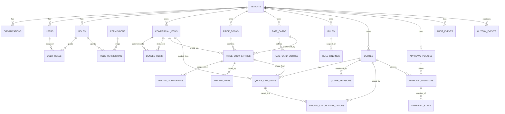

# T002 Deliverable: DB Schema + ERD + Pressure Test

Task ID: T002  
Status: IN_PROGRESS  
Date: 2026-02-25

Primary migration: `/Users/vivek/Documents/smartbusinessvalue/SANCNIDA/ Development/backend/db/migrations/0001_cpq_core_schema.sql`  
Executable pressure test: `/Users/vivek/Documents/smartbusinessvalue/SANCNIDA/ Development/backend/db/tests/pressure_test_scenarios.sql`

## 1. Modeling Philosophy Applied
This schema is modeled by commercial behavior, not industry vertical.

Canonical behavior abstractions:
- Licensed/SaaS
- Subscription/term
- Usage-based
- Fixed-price
- Rate-based
- Bundle/composite
- Custom/non-standard

The core pattern is:
- `commercial_items`: quotable master entity for everything.
- `price_book_entries`: pricing behavior attachment.
- `pricing_components`: composable pricing logic building blocks.
- `metadata_json` (JSONB): extensibility without table explosion.

## 2. Canonical Tables Mapped to Your Required Model

### 2.1 `commercial_items`
- Represents any quotable entity.
- `item_type` references `ref_item_types` (table-driven, no PostgreSQL enum lock-in).
- `metadata_json` holds non-structural attributes (for support package rules, token consumption policy, etc.).

### 2.2 `price_books` + `price_book_entries`
- PriceBook supports multiple strategies per tenant and currency with validity windows.
- PriceBookEntry binds item to pricing model.
- `pricing_model` references `ref_pricing_models`.
- Quantity limits and guardrails captured (`min_qty`, `max_qty`, `min_price`, `max_discount_pct`).

### 2.3 `pricing_components`
- Compositional pricing behavior layer.
- Supports `BASE_PRICE`, `DISCOUNT`, `SURCHARGE`, `REGIONAL_ADJUSTMENT`, `MARGIN_ADJUSTMENT`, `TOKEN_MULTIPLIER`.
- Supports `PERCENT`, `ABSOLUTE`, `FORMULA` with validation check.
- Execution order via `sequence_no`.

### 2.4 `bundle_items`
- Bundle modeled as `commercial_items.item_type = 'BUNDLE'`.
- Bundle lines modeled through `bundle_items` with required/optional inclusion and quantity rule JSON.
- Avoids hardcoding bundle structure into product-specific tables.

### 2.5 `rate_cards` + `rate_card_entries`
- Rate-based services modeled independently.
- PriceBookEntry can reference `ratecard_id` when `pricing_model = RATE_CARD`.

## 3. ER Diagram (Logical)

## 4. Pressure Test Against Required Scenarios

### 4.1 Company 1 (CyberSecurity) Stress Test

1. SaaS platform + add-on modules
- Modeled as `commercial_items` with `item_type = LICENSED_SOFTWARE`.
- Multiple pricing patterns via `price_book_entries.pricing_model` (`PER_USER`, `PER_UNIT`, `TIERED`, etc.).
- Supports feature-level controls in `metadata_json`.

2. Bundles
- Modeled using `item_type = BUNDLE` + `bundle_items` children.
- Required/optional controlled by `inclusion_type`.
- Child override controls via `override_price_allowed`.

3. Maintenance per annum
- Modeled as `item_type = SUBSCRIPTION`.
- Term and renewal attributes in `metadata_json` (e.g., annual cycle, linked product ref).

4. Enterprise support packages (200/500/2000h)
- Modeled as `item_type = SUPPORT_PACKAGE`.
- Hours and overage policy in `metadata_json`.
- Optional overage linkage to rate card through `price_book_entries.ratecard_id`.

5. Data products (reports)
- Modeled as `item_type = DATA_PRODUCT` + `pricing_model = FIXED_PRICE`.

6. Services labor rate card
- Modeled with `rate_cards` + `rate_card_entries`.
- Linked to commercial item via `price_book_entries` with `pricing_model = RATE_CARD`.

7. Hardware
- Modeled as `item_type = HARDWARE` + `pricing_model = PER_UNIT`.

8. Tokens/consumption
- Modeled as `item_type = TOKEN` + `pricing_model = USAGE_BASED`.
- Consumption/expiry/min-commitment rules in `metadata_json`.

Result: PASS (all requested patterns are represented without schema fork).

### 4.2 Company 2 (Service Company)

1. Labor rate card
- Reused directly via `SERVICE + RATE_CARD`.

2. Product licensing
- Reused directly via `LICENSED_SOFTWARE`.

3. Bundles
- Reused directly via `bundle_items`.

4. POCs
- Reused via `item_type = POC` and `pricing_model = CUSTOM` or `FIXED_PRICE`.

Result: PASS (no new table required).

### 4.3 Company 3 (Product Company)

1. Products
- `LICENSED_SOFTWARE` or `HARDWARE`.

2. Services
- `SERVICE + RATE_CARD` or `FIXED_PRICE`.

Result: PASS (trivial mapping with existing abstractions).

## 5. Chaos/Edge Case Robustness Checks

1. New pricing model introduced by tenant
- Can be represented short-term with `CUSTOM` + metadata and rule DSL.
- For full first-class model, add row in `ref_pricing_models` or `tenant_reference_values` (no DDL needed).

2. Noisy pricing logic growth
- Avoided by storing behavior in `pricing_components` + rules DSL instead of proliferating columns/tables.

3. Quote reproducibility over time
- Supported by `quote_revisions.snapshot_json` and `pricing_calculation_traces` with input/output hashes.

4. Multi-tenant isolation pressure
- Every business table includes `tenant_id`.
- Composite tenant indexes included for scale.
- RLS explicitly queued for T003 migration.

5. High-cardinality search and filtering
- GIN indexes on JSONB fields used for metadata selectors.
- Core composite B-tree indexes on tenant + scope columns.

## 6. Risks Found and Mitigations

1. Risk: metadata overuse can degrade quality and queryability.
- Mitigation: enforce metadata JSON schema in application layer; promote repeated keys to typed columns when stable.

2. Risk: cross-table tenant consistency not fully enforced by FK constraints alone.
- Mitigation: T003 add RLS + tenant-aware service layer checks on all joins.

3. Risk: formula_expression injection or unsafe evaluation.
- Mitigation: allowlist rule DSL parser/compiler only; never execute raw SQL/script expressions.

4. Risk: overlapping effective date entries causing ambiguity.
- Mitigation: add exclusion constraints in next migration for key scoped date ranges where needed.

## 7. What Is Ready for Next Step (T003)
- Base schema and migration scaffolding complete.
- Canonical behavior-driven model implemented.
- ERD and scenario stress test documented.
- Next: implement RLS policies and tenant session enforcement.
